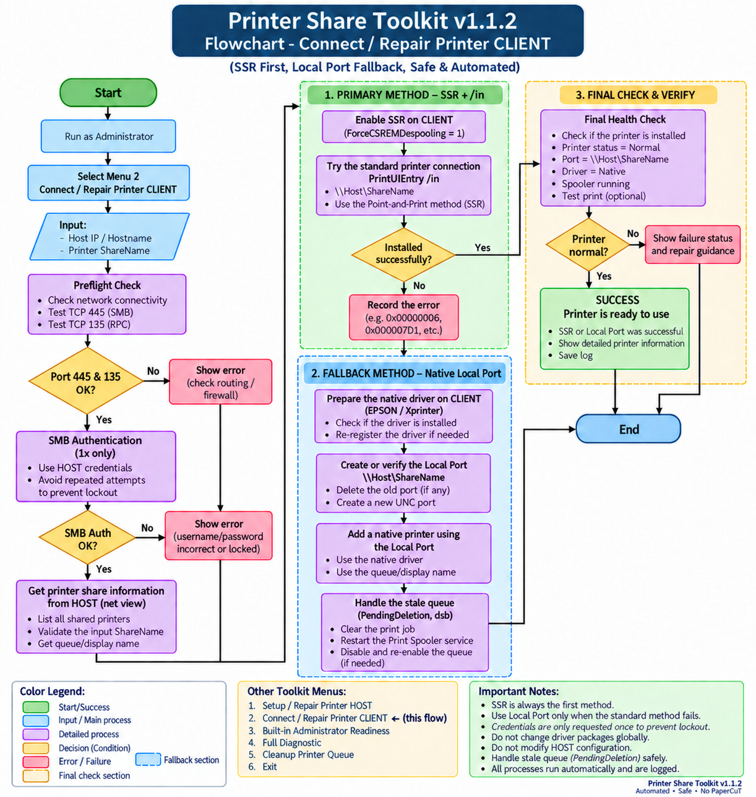

# Printer Share Toolkit

Native Windows USB printer sharing with guided setup, repair, diagnostics, and cleanup.

Current version: **v1.1.2**

## Why I Built This Toolkit

I started building Printer Share Toolkit after dealing with Windows printer-sharing problems over and over again.

Sharing a USB printer sounds simple, but in practice it can turn into hours of troubleshooting. Sometimes the problem is caused by credentials, SMB settings, the Print Spooler, printer drivers, Windows security policies, or an old printer connection that was never removed properly. There are also many Windows error codes, and the same error does not always have the same cause.

Mobility Print is a good solution and works well for many common printers. The downside is that less common brands and specialized printers can be more difficult to configure. Settings such as custom paper sizes, margins, page layouts, continuous paper, or other vendor-specific options may not always be available or easy to manage.

That is why this toolkit focuses on native Windows printer sharing. It gives administrators more control over the original printer driver and its settings. It is not intended to replace Mobility Print completely, but to provide another option when native driver features are important.

This toolkit was not built overnight. Most of its features came from real troubleshooting cases, repeated tests, failed attempts, and lessons learned along the way. My goal is to turn that experience into a simpler and more consistent process for other IT administrators.

## Features

- Setup / Repair Printer HOST
- Connect / Repair Printer CLIENT
- Strict Built-in Administrator **RID 500** readiness gate
- TCP 445 / TCP 135 preflight
- SMB authentication with one-attempt lockout guard
- Server-Side Rendering (**SSR**) first
- Primary install via `PrintUIEntry /in`
- Native Local Port UNC fallback when standard connection fails
- Native driver detection / re-register
- PendingDeletion queue recovery
- Full diagnostic and Windows/SAM health check
- Normal View + Technician View
- Runtime logs, registry backup, and password-free host profiles
- Transaction journal and rollback for reversible HOST changes

No PaperCut dependency.

## Requirements

- Windows 10 / Windows 11
- Windows PowerShell 5.1+
- Administrator elevation
- HOST and CLIENT network path available
- TCP 445 for SMB
- TCP 135 for RPC
- On HOST: Built-in Administrator account identified by SID ending in `-500` must be READY

> Other local users that are members of `Administrators` are intentionally **not** accepted as a replacement for RID 500 in HOST setup.

## Quick Start

1. Download the latest release ZIP.
2. Extract all files.
3. Run `PrinterToolkit.bat`.
4. Approve UAC elevation.
5. Choose the required menu.

Main menu:

```text
[1] Setup / Repair Printer HOST
[2] Connect / Repair Printer CLIENT
[3] Built-in Administrator Readiness
[4] Full Diagnostic
[5] Cleanup Printer Queue
[6] Test Print
[7] Windows/SAM Health Check
[8] Rollback Last HOST Setup
[T] Technician View
[L] Open Logs Folder
[0] Exit
```

## Client Install Strategy

```text
Preflight
   |
   +-- TCP 445 / TCP 135
   +-- SMB authentication
   +-- Share verification
   |
   v
SSR + PrintUIEntry /in
   |
   +-- Success --> Health Check --> READY
   |
   +-- Failed
         |
         v
Native Local Port UNC fallback
         |
         +-- Native CLIENT driver
         +-- \\HOST\Share local port
         +-- Local printer queue
         |
         v
      Health Check
```

## Security Model

- Passwords are not written to logs or host profile JSON.
- SMB credential testing is limited to **one attempt** to reduce account-lockout risk.
- CLIENT credentials may be stored in Windows Credential Manager for the user running the toolkit.
- Do not upload unsanitized `Logs\`, `Profiles\`, screenshots, hostnames, internal IP addresses, or credentials to public issues.

## Documentation

- [User Guide](Docs/USER_GUIDE.md)
- [Troubleshooting](Docs/TROUBLESHOOTING.md)
- [Flowchart](Docs/FLOWCHART.md)
- [Contributing](CONTRIBUTING.md)
- [Security](SECURITY.md)
- [Changelog](CHANGELOG.md)



## Development

Source files:

```text
PrinterToolkit.bat
Core/Launcher.ps1
Core/Toolkit.ps1
```

Create a release ZIP from a clean checkout:

```powershell
powershell.exe -ExecutionPolicy Bypass -File .\scripts\Build-Release.ps1
```

Output is written to `dist\`.
The builder refuses to overwrite an existing release and emits a SHA-256 sidecar plus an in-archive manifest.

Run the non-mutating regression suite before publishing:

```powershell
powershell.exe -NoProfile -ExecutionPolicy Bypass -File .\Tests\Run-All.ps1
```

## Project Rules

The following behavior is intentional and should not be changed casually:

- RID 500 is mandatory for HOST readiness.
- SMB password test stays one-attempt only.
- SSR + `/in` remains the primary CLIENT method.
- Native Local Port is a fallback, not the first method.
- Do not add automatic password brute-force/retry logic.
- Do not bundle third-party printer drivers unless redistribution rights are clear.

## License

MIT. See [LICENSE](LICENSE).
